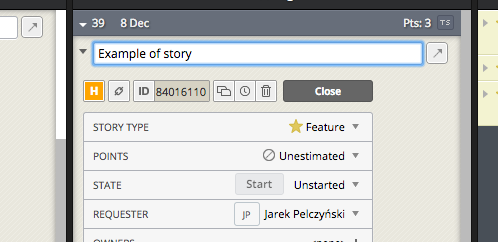

## ABOUT
Extension adds a button (small H orange button next to "Copy story link") to each tasks on Pivotaltracker to copy to clipboard task in format: *[PT 123456789] Some task name*.

---

## GENERATE PACKAGE
1. Install gem: `bundle install`
2. Create extension for Chrome: `rake chrome:create`

---

## INSTALLATION
1. Open on Chrome **Preference > Extensions (CMD + ,)**
2. Drag **source/app.crx** file and drop on Chrome (You should be on Developer Mode)
3. Have fun! :-)
